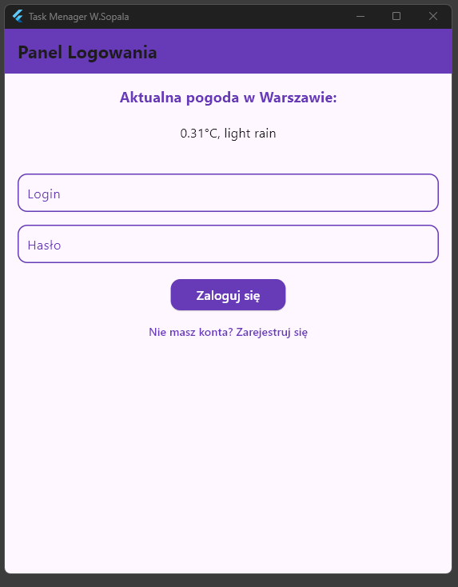
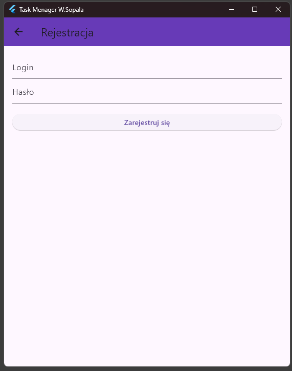
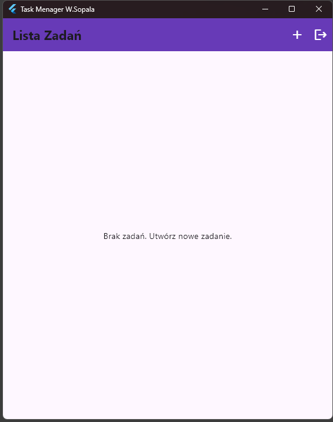
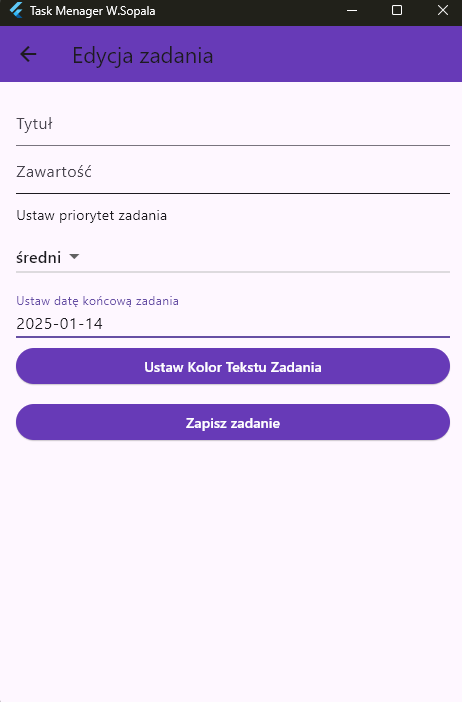
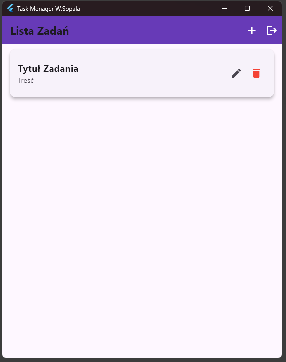
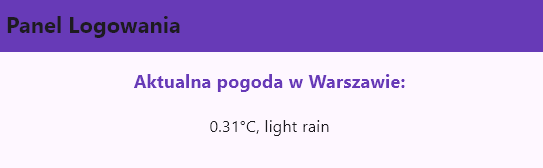

# Task Manager App

Task Manager to aplikacja do zarządzania zadaniami, która pozwala użytkownikom tworzyć, edytować oraz usuwać zadania. Oferuje także możliwość ustawienia koloru zadania, czcionki oraz rozmiaru czcionki. Aplikacja obsługuje logowanie oraz rejestrację użytkowników.

## Funkcjonalności

- **Logowanie** - Użytkownicy mogą zalogować się do aplikacji, wprowadzając swoje dane. 
- **Rejestracja** - Użytkownicy mogą zarejestrować nowe konto w aplikacji. 
- **Lista Zadań** - Po zalogowaniu, użytkownik może przeglądać listę swoich zadań. Każde zadanie można edytować lub usunąć. 
- **Edycja Zadania** - Użytkownicy mogą edytować tytuł, zawartość, ważność zadania, datę końcową zadania oraz kolor tekstu zadania. 
- **Dodawanie Zadań** - Użytkownicy mogą dodawać nowe zadania. 
- **Pogoda** - Aplikacja wyświetla aktualną pogodę w Warszawie na ekranie logowania. 

## Technologie

- **Flutter** - Framework do tworzenia aplikacji mobilnych i desktopowych.
- **Provider** - Biblioteka do zarządzania stanem aplikacji.
- **SQLite** - Baza danych do przechowywania zadań i użytkowników.
- **sqflite_ffi** - Wersja `sqflite` obsługująca platformy desktopowe (Windows, Linux, macOS).
- **Flutter Color Picker** - Biblioteka umożliwiająca wybór koloru.

## Instrukcja uruchomienia

Aby uruchomić aplikację na swoim komputerze, postępuj zgodnie z poniższymi krokami:

1. **Zainstaluj Flutter**:
   Jeśli jeszcze tego nie zrobiłeś, zainstaluj Flutter, postępując zgodnie z oficjalną dokumentacją: [Flutter Installation Guide](https://flutter.dev/docs/get-started/install).

2. **Pobierz repozytorium**:
   Skopiuj repozytorium na swój komputer:
   
   git clone [https://github.com/your-repository/task-manager-app.git](https://github.com/WojtekSop/Task_manager)
   cd task-manager-app
   
3. Zainstaluj zależności: Zainstaluj wszystkie zależności projektu za pomocą polecenia:
   
   flutter pub get

4. Uruchom aplikację: Uruchom aplikację na emulatorze lub podłączonym urządzeniu:

   flutter run
   
5. Baza danych: Aplikacja wykorzystuje SQLite do przechowywania zadań i użytkowników. Ścieżka do bazy danych jest wydrukowana w konsoli podczas uruchamiania aplikacji. Na platformach desktopowych (Windows, Linux,     macOS) używana jest wersja sqflite_ffi.

## Opis aplikacji
Aplikacja składa się z kilku ekranów:

1. LoginScreen
Ekran logowania, na którym użytkownicy wprowadzają swoje dane do logowania. Aplikacja wyświetla również aktualną pogodę w Warszawie.

2. RegisterScreen
Ekran rejestracji, gdzie użytkownicy mogą założyć nowe konto podając login oraz hasło.

3. HomeScreen
Ekran główny aplikacji, który wyświetla listę zadań użytkownika. Można dodać nowe zadanie, edytować istniejące lub je usunąć.

4. EditScreen
Ekran umożliwiający edytowanie zadania. Użytkownicy mogą zmieniać tytuł, zawartość, ważność zadania, datę końcową wykonania zadania, kolor tekstu zadania oraz zaznaczyć zadanie jako ukończone.

5. TaskTile
Widok pojedynczego zadania, który wyświetla tytuł, zawartość oraz przycisk do edycji zadania. Kolor tekstu zadania jest dostosowywany na podstawie ustawionego koloru.

Wymagania
Flutter 3.0 lub nowszy
Platforma desktopowa (Windows, Linux, macOS) lub urządzenie mobilne (Android, iOS)
Baza danych SQLite

## Licencja

Aplikacja jest dostępna na licencji MIT. Możesz ją dowolnie modyfikować, używać i rozpowszechniać, pod warunkiem zachowania informacji o autorze.

